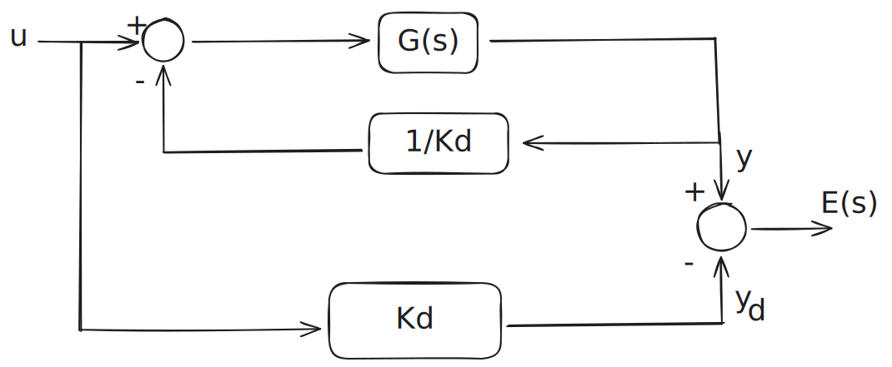
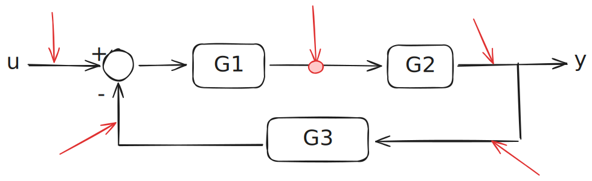

# Comportamento a regime
1. Stabilità, variare del KC, funzione di trasferimento a ciclo chiuso.

$$
\begin{gather}
W(s) = \frac { k P(s) } { 1 + kP(s) } \\\ \space \\\
P(s) = \frac 1 {s + 2} \quad 
\\\
\text{1 polo a parte reale negativa}  
\\\
-2 < k \leq \infty
\\\  \space \\\
W(s) = \frac { k \frac 1 {s + 2} } { 1 + k \frac 1 {s + 2} }
 \\\ \space \\\
W(s) = \frac { k \frac 1 {s + 2} } { \frac {s + 2}{s + 2} + k \frac 1 {s + 2} }
 \\\ \space \\\
W(s) = \frac { k  } { s + 2 + k  }
\end{gather}
$$

>- K = 0 non passa nulla
>- $K \to \infty \quad W = 1$
>- $K \to 0 \quad \space\space W = \text {si riduce}$

### Applico il teorema del valor finale

$$
\lim_{s \to 0} s \frac k {s+2+k} \frac 1 s = \frac k {2+k}
$$

### Sistema di controllo

$K_d$ spesso chiamata costante di proporzione tra ingresso e uscita.

Voglio che $y_d(s)$ sia uguale ad $y(s)$, e quindi che la loro differenza $E(s)$ sia nulla.

Scelgo il segnale canonico $\frac{t^k}{k!}$ che trasformato diventa $\frac1{s^{k+1}}$.

$$
E(s)=(Kd-\frac{G(s)}{1+\frac{1}{K_d}G(s)})U(s)=\frac{K_d^2}{K_d+G(s)}U(s)
$$

$$
e(\infty)=\lim_{s\rightarrow0}s\frac{K_d^2}{K_d+G(s)}\frac1{s^{k+1}}=0
$$

So che $G(s)$ è costituita da controllore e processo da controllare. Io posso agire solo sul controllore (ad esempio aggiungendo poli in 0, detti integratori), quindi riscrivo $G(s)$ esplicitando gli integratori, su cui ho controllo: $G(s)=\frac{G'(s)}{s^h}$. Mi importa solo che il controllore che poi ottengo sia causale.

$$
\lim_{s\rightarrow0}\frac{s^{h-k}K_d^2}{s^hK_d+G'(s)}=0
$$

Per far convergere questo limite a 0 bisogno che $h$ sia maggiore di $k$ (altrimenti andrei ad azzerare il denominatore facendo tendere tutto a infinito). Quindi devo aggiungere tanti integratori quanti ne servono per avere $h\ge k$.

Nel caso in cui $h=k$ ho:

- Se sono entrambi nulli: $e(\infty)=\frac{K_d^2}{K_d+K_g}$.
- Se sono entrambi ≥ 1 allora $e(\infty)=\frac{K_d^2}{K_g}$

$K_g$ è semplicemente il valore che $G’(s)$ assume in 0, visto che facciamo il limite per $s\rightarrow0$.

$h$ definisce il tipo di sistema di controllo
| $\frac k h $ | 0 | 1 | 2 |
|----------|----------|----------|----------|
| 0   | $\frac{K_d^2}{K_d+K_g}$   | $\infty$  | $\infty$   |
| 1   | 0   | $\frac{K_d^2}{K_g}$   | $\infty$  |
| 2   | 0   | 0   | $\frac{K_d^2}{K_g}$   |

### Errori

$$
e(t)= y_d(t)-y(t)\\\
\space\\\
E(s)= K_dU(s) - W(s)U(s)
$$

trasferimento ingresso errore $W_e(s)$

$$
W_e(s)
= \frac {E(s)}{U(s)} = \frac {k_d^2}{K_d+ G(s)}
$$

$$
e(\infty)= \lim_{t\to\infty} e(t)= \lim_{s\to0}sE(s)= \lim_{s\to0}sW_e(s)U(s)
$$

Definisco G(s), e la Kg come guadagno generalizzato che è eliminabile nei poli e ponendo s = 0

Kg quando s = 0 si chiama guadagno statico. No poli nel origine. 

Se h > k  → e(inf) = 0

- se h  = k → e(inf) = costante
- vedere gli altri casi sopra

$$
G(s) = C(s)P(s)
\\
\space
\\
C(s)= \frac {K_c}{s^l}
$$

### Disturbi

- disturbo dello stato, quando entra in catena diretta
- disturbo sull’uscita, quando entra in catena diretta
- disturbo sulla misura, blocco di retroazione
- disturbo in retroazione, a valle del blocco di retroazione

$$
Z_k(s)= \frac{1}{s^{k+1}} \space , \quad k= 0, 1,2,...
$$

>Aggiungo poli necessari nelle funzione G1
>
>Riscrivo i controllori come 1/Kd
>
>3 casi:
>
>- h>k      yz1(inf)= 0
>- h=k      yz1(inf)= costante
>- h=k      yz1(inf)= inf

<aside>

>[!TIP]
>Sistema Astatico, se un sistema di controllo rispetto a un disturbo z costante, tende ad annullarsi.

</aside>
