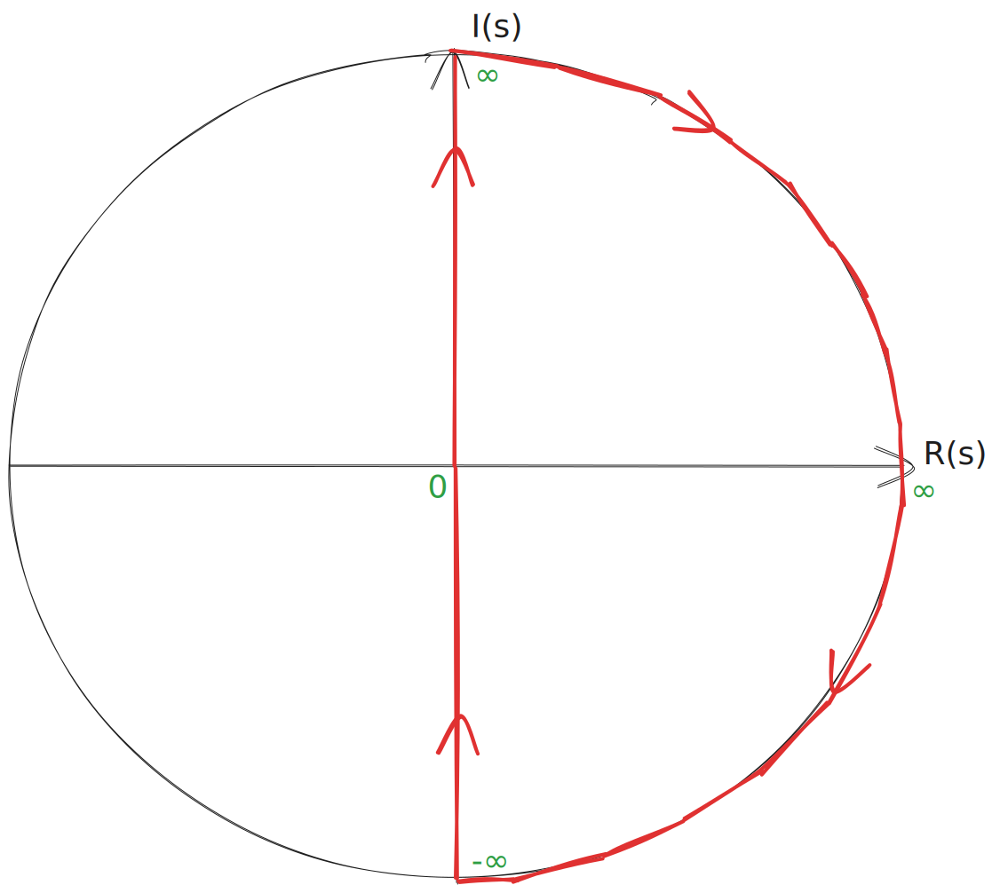
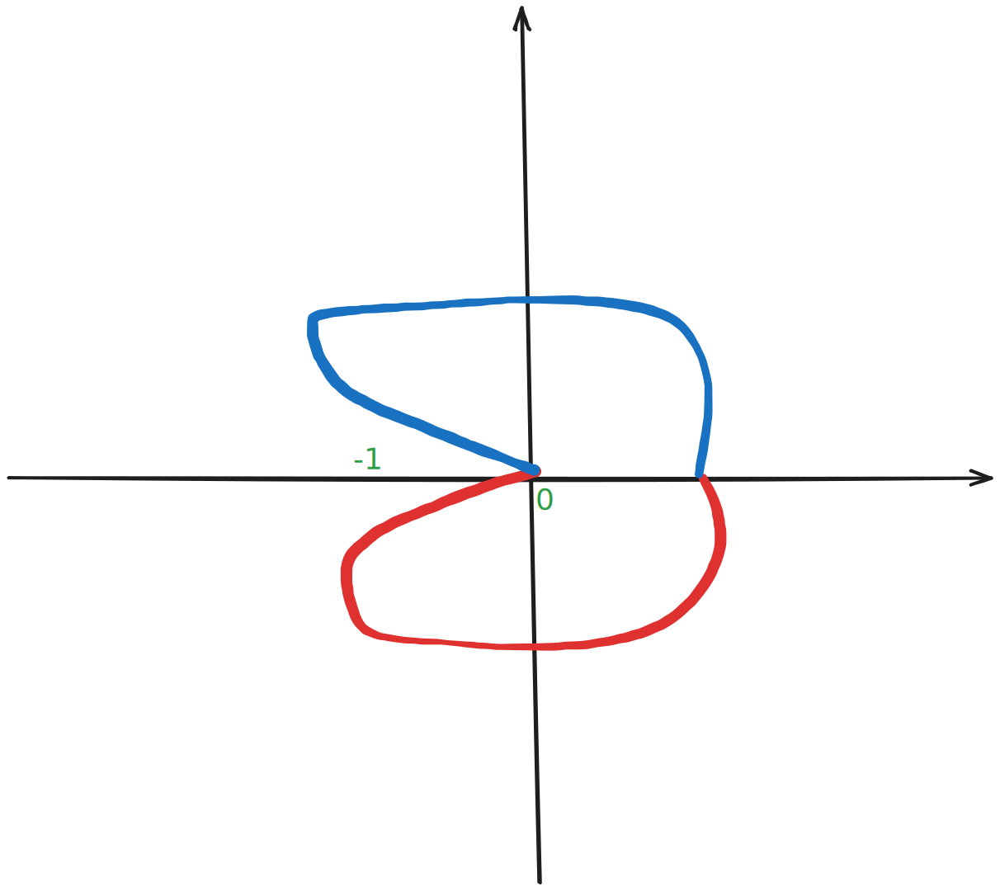

# Criterio di stabilità di Nyquist
Per dimostrare il criterio di stabilità di Nyquist usiamo il teorema dell’indicatore logaritmico.

Prendiamo una funzione del tipo $F(s)=\frac{s-a}{s-b}$, che ha un polo in $b$ e uno zero in $a$.

$$
W(s)=\frac{F(s)}{1+F(s)}\Rightarrow F(s)=\frac{N(s)}{D(s)}\Rightarrow W(s)=\frac{N(s)}{D(s)+N(s)}
$$

Quindi al momento ho $W=\frac{N}{D+N}$ e $F=\frac ND$.

Ora introduco $1+F(s)$, che sarà uguale a $\frac{D+N}D$.

È facile notare che i poli di $W$ corrispondono agli zeri di $1+F$, mentre i poli di $1+F$ corrispondono ai poli di $F$.

$$
\begin{gather}
1+F = \frac {(N+D)}{D} \quad W = \frac N{(N+D)} \\\
\space \\\
1+F = \frac {N+D}{(D)}\quad F = \frac N {(D)} 
\end{gather}
$$

Adesso possiamo usare l’indicatore logaritmico, considerando come curva da percorrere quella di Nyquist (che avvolge tutto il semipiano complesso a parte reale positiva). In questo modo sappiamo che i poli e gli zeri all’interno della curva sono quelli a parte reale positiva.

<aside>

>Se abbiamo una radice proprio sull’asse verticale allora possiamo considerarla a sinistra della curva di Nyquist (come se la curva passasse a destra di quella radice)

</aside>

Percorso $\gamma$ di Nyquist: (percorso in senso orario)

$$
\begin{gather}
R_{(F+1)_\gamma,0}=\text{zeri}_{p.r.p} \text {(a parte reale positiva)}[F+1]-\text{poli }_{p.r.p}[F+1]\\
\space \\
R_{(F+1)_\gamma,0}=\text{poli}_{p.r.p}[W]-\text{poli}_{p.r.p}[F]
\end{gather}
$$

Noi vogliamo stabilità! e imponiamo che

$$
\@ \text{poli}_{p.r.p}[W(s)] = 0
$$

> Condizione Necessaria e sufficiente, affinché W sia stabile:
> 
>$$R_{(F+1)_\gamma,0}=-\text{poli}_{p.r.p}[F]$$
> 
>$$R_{(F)_\gamma,-1}=-\text{poli}_{p.r.p}[F]$$
> 

$$\\
R_{(F+1)_\gamma,0}=-\text{poli}_{p.r.p}[F]
$$

Dato che il percorso $\gamma$ di Nyquist percorre tutto il piano Immaginario, possiamo trasformare
$s = j\omega$ e disegnare in coordinate polari $F(j\omega)$

- tracciato il diagramma completo di Nyquist, se le rotazioni a -1 coincidono con 
$R_{(F)_\gamma,-1}=-\text{poli}_{p.r.p}[F]$ allora il sistema a ciclo chiuso risulterà stabile.

<aside>

>Questa equazione ci dice che il sistema a ciclo chiuso è stabile se e solo se (doppia implicazione) la funzione F(s) gira intorno al -1 tante volte quanti sono i poli a parte reale positiva di $F(s)$. Se $F(s)$ stessa è stabile e ha solo poli a parte reale negativa, allora girerà 0 volte intorno al -1 e quindi il sistema è sicuramente stabile.
>
>Questo rende molto utile il diagramma di Nyquist, perché permette di vedere le rotazioni intorno a -1 e usarle per determinare la stabilità del sistema anche se $F(s)$ ha poli instabili.

</aside>

I diagrammi di Nyquist finiscono sempre con il convergere nell’origine, i poli sono più degli zeri, il modulo nei digrammi di bode decrescerà indefinitamente.

In blue il la parte immaginaria negativa della curva di nyquist, che è il coniugato della parte positiva.
