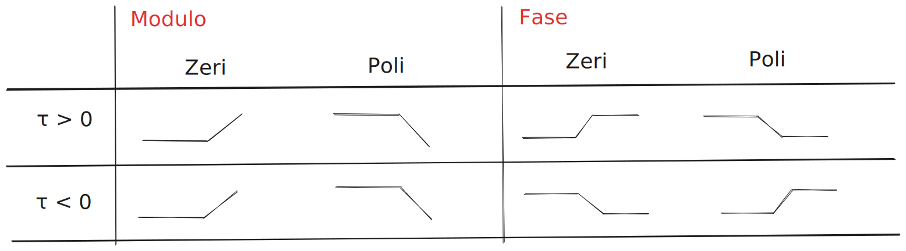

# Diagramma di bode
$$
X_{db}=20\log_{10}|X|
$$

Il Bode è una coppia di grafici che hanno $\omega$ sull’asse orizzontale. Su quello verticale uno ha la fase, l’altro ha il modulo in dB

Vediamo come si traccia il Bode di una funzione del tipo:

$$
G(s)=K_gs^h\frac{(\frac{s^2}{\omega^2_{r_i}}+\frac{2{\zeta_i}}{\omega_{r_i}}s+1)(sr_i+1)}{(\frac{s^2}{\omega^2_{r_j}}+\frac{2{\zeta_j}}{\omega_{r_j}}s+1)(sr_j+1)}
$$

<aside>

>Vediamo che c’è un termine costante $K_g$, il termine $s^h$ che è legato alle radici in 0, vari termini binomi normalizzati in modo da diventare 1 per $s=0$, vari termini trinomi anch’essi normalizzati.
>
>Ognuno di questi termini ha un contributo su quello che esce nel diagramma di Bode, i contributi vengono tutti sommati. Per capire i contributi di ogni termine basta porre $s=j\omega$ e vedere come cambia il contributo col variare di $\omega$

</aside>

- Termine $K_g$
    - Il contributo che ha sul modulo è $20\log_{10}|K_g|$
    - Il contributo che ha sulla fase è 0° se è positivo, -180° se è negativo
- Termine $s^h$
    - Il contributo sul modulo è $20h\log_{10}\omega$
    - Il contributo sulla fase è $h 90°$

---

Ricorda di applicare questo!

$$
s^h \to (jw)^h
$$

---

$$
\begin{gather}
|(jw)^h| = w^h\\\
|(jw)^h|_{db} = |(w)^h|_{db} = 20 \space h \space \log_{10}w = 20h\lambda\\\
w = 10^\lambda \to decadi
\end{gather}
$$

- h =  1  → cresco di 20db ogni decado
- h =  2  → cresco di 40db ogni decado
- h = -1 → cresco di -20db ogni decado
- h = -2 → cresco di -40db ogni decado

$$
\begin{gather}
∠^{ \text{Fase Zeri}} = h * 90\\\
∠^{ \text{Fase Poli}} = h * -90
\end{gather}
$$

- Termine $(1+s\tau) \to j \omega \tau +1$
    
  
    
    - Ponendo $\tau > 0$
    
    
  
    
    - $\omega\tau$>>1
        - $20\log_{10}(\omega)= 20\lambda$
        - fase di 90*
    - $\omega\tau$<<1
        - $20\log_{10}(1)= 0$
        - fase di 0*
    - $\omega\tau \approx 1$ - Non si sa bene ma
        - fase di 45*
        
    - Quando ci troviamo a sinistra del punto di rottura ($\omega<<\frac1r)$ possiamo considerare nullo quel logaritmo (si tratta di un’approssimazione che ci porta ad un errore massimo di circa 3dB nel punto di rottura)
    - Quando ci troviamo a destra del punto di rottura invece possiamo ignorare l’1 all’interno del logaritmo e vediamo che il contributo è circa $20\log_{10}\omega+20\log_{10}r$
    
- Termine $(\frac{s^2}{\omega^2_{r_i}}+\frac{2{\zeta_i}}{\omega_{r_i}}s+1)$
    - Funzione di trasferimento con s = jw
    - Il contributo sul modulo è $10\log_{10}((1-\frac{\omega^2}{\omega_r^2})^2+(2\zeta\frac{\omega}{\omega_r})^2)$
        - Se mi trovo a sinistra del punto di rottura ($\omega<<\omega_r$) il contributo si annulla
        - Se mi trovo proprio sul punto di rottura il contributo è
            
$$
\begin{gather}
(\frac{2\zeta\omega}{\omega_r})^2+(1-\frac{\omega^2}{\omega_r^2})^2  
\quad \to \quad
\approx \frac {\omega^4}{\omega_r^4} \\
\\
10\log_{10}(\frac {\omega^4}{\omega_r^4}) 
\to 
40\log_{10}({\omega}) - 40\log_{10}({\omega_r})
\to  40\log_{10}({\omega}) = 40\lambda \\
= 20\log_{10}(2\zeta)
\end{gather}
$$

            
    
  Anche qui sale se siamo al numeratore e scende al denominatore.
    
   - Il contributo sulla fase è di 180°, anche qui applicato gradualmente. Lo capisco analizzando la fase di $(1-\frac{\omega^2}{\omega_r^2})+j(2\zeta\frac{\omega}{\omega_r})$, noto infatti che la parte reale cresce molto più velocemente e tende ad appiattire la fase sui 180°
        - Se siamo a sinistra del punto di rottura la fase è circa 0
        - Se siamo sul punto di rottura è 90°
        - Se siamo a destra del punto di rottura la fase tende a 180°
    
  Il contributo di fase è positivo se siamo al numeratore e negativo al denominatore, va inoltre ribaltato sottosopra se $\omega_r$ è negativo (però una pulsazione negativa non avrebbe senso, quindi non si verifica)
    
  I contributi di ognuno di questi termini si sommano per ottenere il diagramma di Bode
    
  
  ***
    
  <aside>
    
   > Anti-Risonanza: $\omega = \omega_n$  si presenta un picco.
   > 
   > Risonanza: Opposto alla risonanza quando il trinomio si trova a denominatore.
   > 
   > - Trinomio costituito da coppia di complessi e coniugati, il contributo alla variazione del modulo va sottratta.
    </aside>
