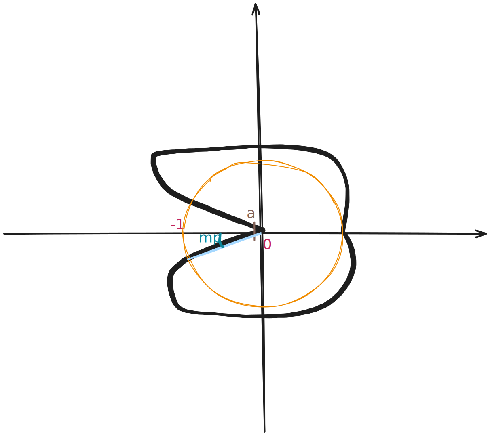
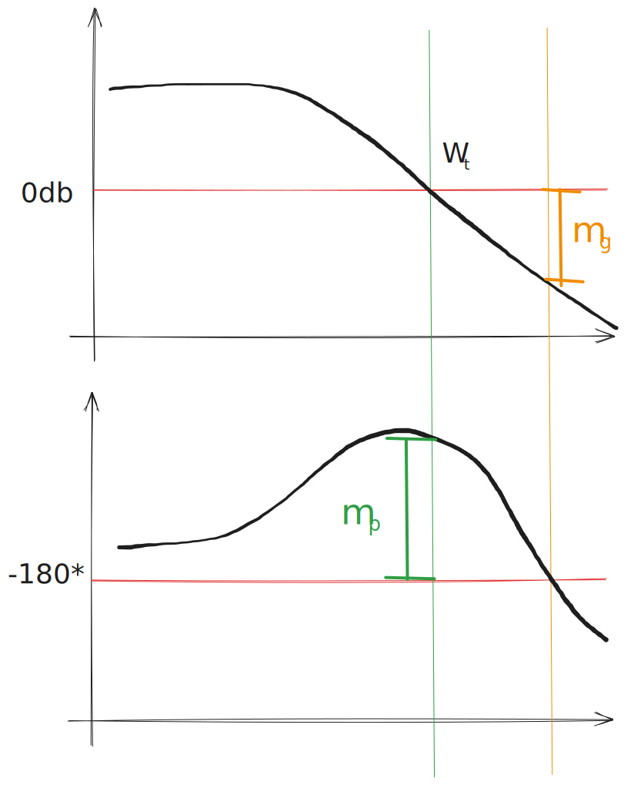

# Margini di stabilità (guadagno e fase)
Si parla di margini di stabilità quando si ha un sistema asintoticamente stabile e se ne vuole capire meglio la stabilità.

Questo significa vedere quanto possiamo guadagnare o perdere in fase e modulo senza cadere nell’instabilità.

Come detto a Nyquist il sistema a ciclo chiuso può essere comunque stabile anche se la funzione in catena diretta ha poli a parte reale positiva. L’unica condizione è che ruoti intorno a -1 tante volte quanti i poli a parte reale positiva.

Qui però stiamo analizzando solo la funzione nella catena diretta, si tratta di un caso più semplice quindi non consideriamo il criterio di Nyquist, ci limitiamo a dire che una funzione è instabile se ingloba il -1.

Qui sotto c’è il diagramma di Nyquist di una funzione stabile.

Noto che posso ancora moltiplicare il modulo per un guadagno $k\le\frac1a$ (se vado oltre inglobo il -1).

> Margine di guadagno $m_g = \frac 1 a$
> 
- $m_g = 1$ siamo al limite della stabilità.

Posso anche ruotare la funzione fino a $m_\phi$ (Margine di fase) gradi in senso orario prima di perdere la stabilità.

<aside>

>$m_\phi$ è ottenibile dalla circonferenza unitaria, partendo dal intersezione con la curva al omega di taglio $\omega_t$ (dove l’attraversamento a 0db) fino al origine e l’angolo ottenuto con il piano è l’angolo.

</aside>

Questi quindi erano i margini di guadagno e fase in Nyquist.

### Bode

Nel caso del Bode, una funzione è instabile se nel punto in cui la fase è -180° il modulo in dB è maggiore di 0. Infatti queste condizioni equivalgono ad inglobare il -1 nel diagramma di Nyquist.

Il margine di guadagno è lo spazio tra il modulo in dB e 0 in corrispondenza della frequenza in cui si toccano i -180°. Il margine di fase è lo spazio tra la fase e i -180° in corrispondenza della frequenza di taglio.

Se la fase non tocca mai i -180° allora il margine di guadagno è infinito.
