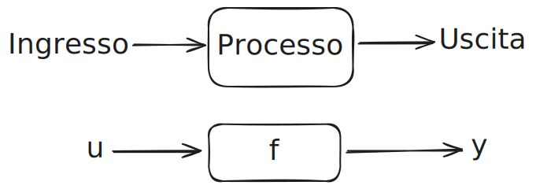
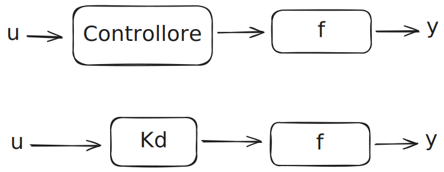
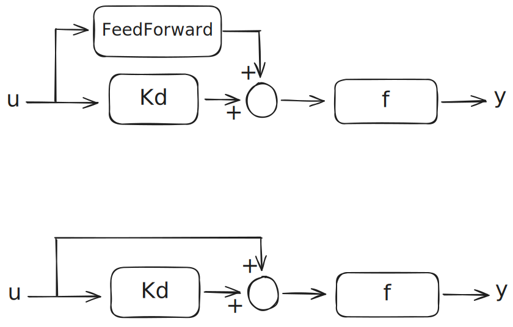
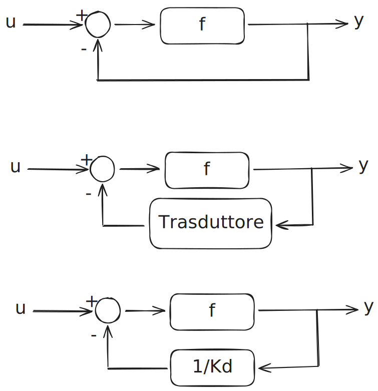
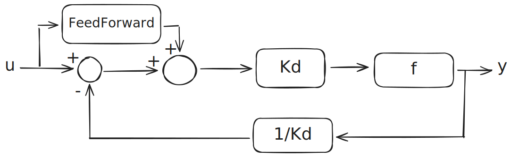

# Rappresentazioni Ingresso-Uscita

<details>
<summary><h2>Rappresentazione di un sistema</h2></summary>

### Semplice
>
>- u = entrata
>- y = uscita

### Guadagno
>
>- Kd = Controllore o guadagno o proporzionale
>```math
>y(t) = Kd * f * u(t)
>```

### FeedForward
>
>- Richiede che si da per certi di non avere disturbi
>```math
>\begin{aligned}
>y(t) = (u(t)( 1 \text{ FeedForward} + Kd)) * f \\\
>y(t) = (u(t) * \text{ FeedForward} + u(t)*Kd)) * f
>\end{aligned}
>```
### Feedback
>
>
>```math
>\begin{aligned}
>\text {Senza trasduttore} \to \frac{f}{1+f} \\\
>\text {Con trasduttore} \frac {1}{Kd} \to \frac{f}{1+f \frac 1 {Kg}} 
>\end{aligned}
>```
### Esempio di sistemi complessi
>
  
</details>


<details>
<summary><h2>Laplace</h2></summary>

>### Trasformata
>```math
>L \space \{f(t)\} = \int_{o^-}^{\infty}{f(x) e^{-st} dt} = F(s)
>```

>### Anti Trasformata
>```math
>L^{-1}\space = \{ F(s)\} = \frac{1}{2\pi i} \lim_{T \to \infty} \int_{\gamma-iT}^{\gamma+iT} {e^{sT} F(s) ds} = f(t)
>```

>Ascissa di convergenza
>```math
>s = \sigma + j \omega 
>```
>```math
>e^{-\sigma t} + e^{- j \omega t}
>```
>```math
>\sigma \text{ deve tendere a } \infty \text{ per mandare e}\to 0 
>```
>```math
>\text {Nelle trasformate vogliamo che } Re[s] > Re[p] = \sigma \\
>```
>```math
>\text {e che } \sigma \text { sia } \leq 0 \text { per la stabilità}
>```


  
</details>

