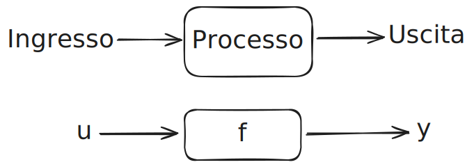
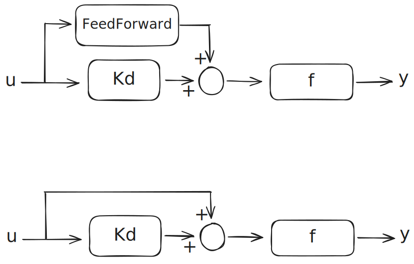
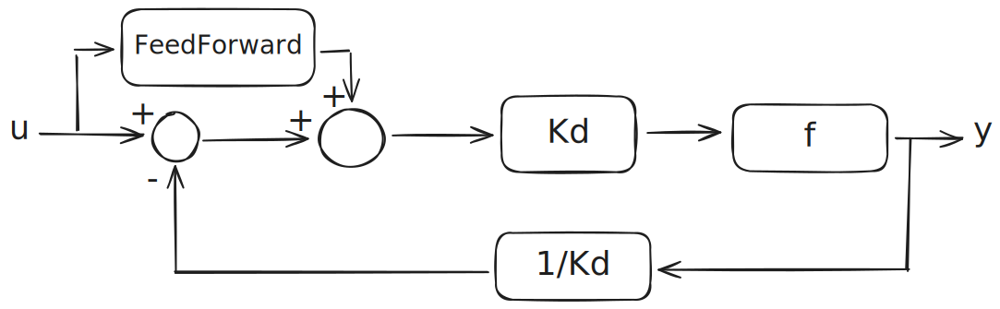

# Rappresentazione di un sistema

### Semplice
>
>- u = entrata
>- y = uscita

### Guadagno
>
>- Kd = Controllore o guadagno o proporzionale
>```math
>y(t) = Kd * f * u(t)
>```

### FeedForward
>
>- Richiede che si da per certi di non avere disturbi
>```math
>\begin{aligned}
>y(t) = (u(t)( 1 \text{ FeedForward} + Kd)) * f \\\
>y(t) = (u(t) * \text{ FeedForward} + u(t)*Kd)) * f
>\end{aligned}
>```
### Feedback
>
>
>```math
>\begin{aligned}
>\text {Senza trasduttore} \to \frac{f}{1+f} \\\
>\text {Con trasduttore} \frac {1}{Kd} \to \frac{f}{1+f \frac 1 {Kg}} 
>\end{aligned}
>```
### Esempio di sistemi complessi
>
