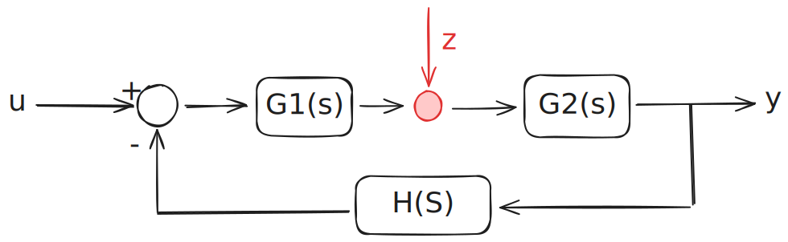

# Reiezione di disturbi polinomiali
<aside>

>**Sistema Astatico**, se un sistema di controllo rispetto a un disturbo z costante, tende ad annullarsi.

</aside>

Gli errori infatti non sono che ingressi in catena diretta che non sono desiderati e non sono misurabili. Non è possibile rifiutare errori che si trovano nel feedback.

Quindi abbiamo $W_z(s)=\frac{G_2(s)}{1+G_1(s)G_2(s)H(s)}$

$$
Z_k(s)= \frac{1}{s^{k+1}} \space , \quad k= 0, 1,2,...
$$

Applico il teorema del valor finale, impongo quindi che l'effetto dell'errore sia nullo.

$$
\lim_{s\rightarrow0}sW_z(s)z(s)=\lim_{s\rightarrow0}s\frac{G_2(s)}{1+G_1(s)G_2(s)H(s)}\frac1{s^{k+1}}=0
$$

$$
G_1(s)= \frac {G_1'}{s^h}
$$

$$
\lim_{s\rightarrow0}\frac{s^{h-k}G_2(s)}{s^h+G_1'(s)G_2(s)H(s)}=0
$$

Quello che ho fatto è stato aggiungere integratori a monte del disturbo (su $G_1$, se lo avessi fatto dopo non avrei avuto lo stesso effetto). Vedo quindi che per rigettare un disturbo ho bisogno di un numero di integratori $h$ a monte maggiore di $k$.

Se anche qui abbiamo $h=k$, viene fuori che $e_z(\infty)=\frac{K_{G_2}}{K_{G_1} K_{G_2} K_{h}}$ (se sono entrambi nulli ci va anche $+1$ al denominatore)

Un sistema con $h=1$ è in grado di rigettare un disturbo costante, è detto quindi astatico.

*Stabilita*: → $k + 1 = h(integratori)$
