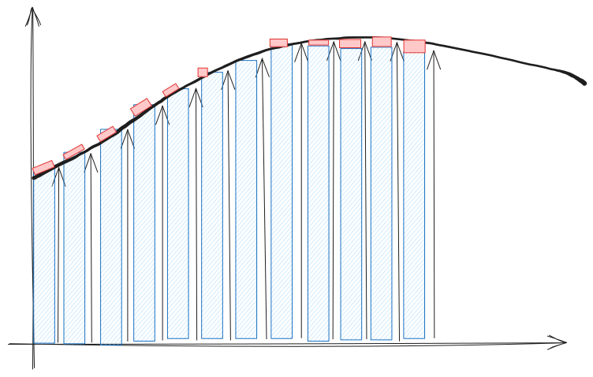
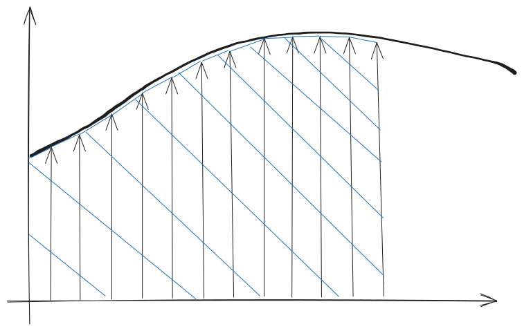

# Mapping dal piano S al piano Z

### La Relazione Fondamentale

La corrispondenza tra la variabile complessa $s$ (del piano di Laplace) e la variabile complessa $z$ (del piano $Z$) è stabilita dalla trasformazione:

$$z = e^{s T_c}$$

dove $T_c$ è il tempo di campionamento.

Questa relazione deriva dal fatto che la Trasformata di Laplace di un segnale campionato $x_c(t)$ (ottenuto come prodotto del segnale continuo $x(t)$ per un treno di impulsi $\delta_{T_c}(t)$ ) è strettamente correlata alla $Z$-trasformata della sequenza di campioni $\{x(kT_c)\}$.

### Implicazioni della Mappatura

L'analisi dei sistemi di controllo lineari a tempo continuo è guidata dalla posizione di poli e zeri nel piano $S$. La mappatura $z = e^{s T_c}$ consente di estendere questo approccio ai sistemi a tempo discreto.

1.  **Periodicità:**
    La trasformazione $z = e^{s T_c}$ implica che tutti i punti $s + jn\omega_c$, dove $\omega_c = 2\pi/T_c$ è la pulsazione di campionamento, vengono proiettati nello stesso punto $e^{s T_c}$ del piano $Z$. Questo è in analogia con la periodicità dello spettro dei segnali campionati.
    Di conseguenza, solo una semistriscia principale del piano $S$ (ad esempio, quella definita da $\text{Im}[s] \in [-\omega_c/2, \omega_c/2]$ e $\text{Re}[s] < 0$ ) viene mappata univocamente all'interno del cerchio unitario del piano $Z$.

2.  **Mappatura del Semipiano Sinistro (Stabilità):**
    Il **semipiano sinistro** del piano $S$ ($\text{Re}[s] < 0$), dove risiedono i poli per la stabilità asintotica nei sistemi continui, viene proiettato **all'interno del cerchio di raggio unitario** (o cerchio unitario) nel piano $Z$.
    *   **Stabilità Asintotica:** Se i poli del sistema continuo $G(s)$ hanno $\text{Re}[s] < 0$, i corrispondenti poli discreti $G(z)$ si trovano **all'interno del cerchio unitario** nel piano $Z$.
    *   **Limiti di Stabilità:** L'**asse immaginario** del piano $S$ ($\text{Re}[s] = 0$) si trasforma nella **circonferenza di raggio unitario** nel piano $Z$ ($|z|=1$). Per i sistemi discreti, i poli che si trovano esattamente sulla circonferenza unitaria indicano uno stato di limite di stabilità.
    *   **Instabilità:** Il semipiano destro del piano $S$ ($\text{Re}[s] > 0$) si proietta all'esterno del cerchio unitario.

3.  **Mappatura della Striscia Primaria:**
    La semifascia principale sinistra del piano $S$ viene proiettata all'interno del cerchio unitario, mentre l'asse immaginario diventa la circonferenza di raggio unitario.
    Lungo l'asse immaginario del piano $S$:
    *   Il segmento $\text{Re}[s] = 0$ e $\text{Im}[s] \in [-\pi/T_c, \pi/T_c]$ (la striscia principale) si trasforma nella circonferenza di raggio unitario nel piano $Z$.

### Trasformazioni Approssimate

Oltre alla trasformazione esatta $z = e^{s T_c}$ (spesso utilizzata in combinazione con l'organo di tenuta ZOH, vedi conversazione precedente), esistono **metodi approssimati** per discretizzare una funzione di trasferimento continua $G(s)$, che implicano diverse mappature tra i due piani:

1.  **Differenze all'Indietro (Backward Difference):** Questa approssimazione dell'integrale risulta nella mappatura:
    $$s = \frac{1 - z^{-1}}{T_c} = \frac{z - 1}{T_c z}$$
    In questo caso, la regione di stabilità nel piano $S$ ($\text{Re}[s] < 0$) viene mappata all'interno di una circonferenza centrata in $(1/2, 0)$ e con raggio $1/2$ nel piano $Z$. Questo metodo garantisce che una funzione stabile in $S$ rimanga stabile in $Z$.
    

3.  **Differenze in Avanti (Forward Difference):** Questa approssimazione (utilizzando il valore iniziale dell'intervallo per l'integrale) risulta nella mappatura:
    $$s = \frac{z - 1}{T_c}$$
    Questo metodo può trasformare funzioni stabili in $S$ in funzioni instabili in $Z$, ed è generalmente sconsigliato.
    

5.  **Trasformazione Bilineare (Tustin):** Basata sull'integrazione trapezoidale, questa trasformazione risulta nella mappatura:
    $$s = \frac{2}{T_c} \frac{z - 1}{z + 1}$$
    La trasformazione di Tustin mappa la stabilità (semipiano sinistro di $S$) all'interno del cerchio unitario di $Z$. Causa distorsioni alle alte frequenze che possono essere mitigate con la precompensazione frequenziale (prewarping).
    

In sintesi, mentre la relazione fondamentale $z = e^{s T_c}$ definisce la corrispondenza esatta di poli e zeri (in termini di modi propri) tra i due domini, le trasformazioni approssimate offrono metodi pratici per convertire la funzione di trasferimento continua in una discreta.

***

Sul libro di testo ci sono anche altre cose non presenti qui, relativamente utili, tra cui grafici utili per capire questa domanda.
