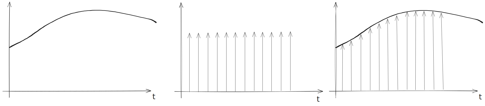
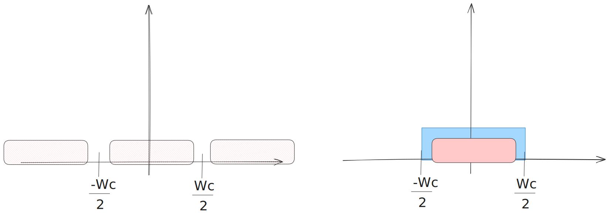
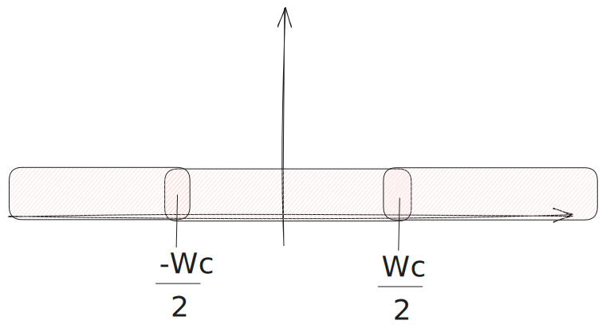

# Teorema del campionamento (spettro di un segnale campionato, ricostruttore di Shannon)

Il **Teorema del campionamento** (o teorema di Shannon) è fondamentale nell'analisi dei **Sistemi di Controllo Digitale** e stabilisce le condizioni per convertire un segnale continuo (analogico) in un segnale discreto senza perdere contenuto informativo.

>Prendo un segnale, lo moltiplico per un pettine/ treno di impulsi e ottendo un infinità di lobi

>Ogni lobo ha le stesse informazioni ma sono traslati, percio uso un filtro e ottengo un singolo non che ha le stesse informazioni del segnale originario

> In presenza di aliasing ci troviamo una situazione simile

---

## Spettro di un Segnale Campionato

Il segnale campionato $x_c(t)$ si ottiene moltiplicando il segnale originale $x(t)$ per un treno di impulsi di Dirac, posizionati agli istanti di campionamento $k T_c$.

1. **Periodicità:**  
   La trasformata di Laplace $X_c(s)$ di questo segnale campionato risulta **periodica** rispetto alla parte immaginaria $w = \text{Im}[s]$, con periodo $\omega_c = 2\pi/T_c$.  
   Di conseguenza, lo **spettro di ampiezza** (trasformata di Fourier) è anch'esso periodico.

2. **Teorema del Campionamento:**  
   Lo spettro campionato $X_c(\omega)$ è composto da infinite repliche (lobi) dello spettro del segnale analogico originale $X(\omega)$, traslate di multipli di $\omega_c$.

3. **Condizione di Nyquist:**  
   Affinché il contenuto informativo del segnale sia preservato, è necessario che la **pulsazione massima** $\omega_{\max}$ presente nel segnale originale sia inferiore alla metà della pulsazione di campionamento $\omega_c/2$.
   - Se $\omega_c > 2 \omega_{\max}$, i lobi dello spettro non si sovrappongono e l'informazione è conservata. La frequenza $f_c/2$ viene definita **frequenza di Nyquist**.
   - Se $\omega_{\max} > \omega_c/2$, si verifica il fenomeno di **aliasing** (sovrapposizione degli spettri), che distorce il segnale e impedisce la ricostruzione esatta.

---

## Ricostruttore di Shannon

Se il segnale è campionato correttamente (rispettando il criterio di Nyquist), è teoricamente possibile ottenere una **ricostruzione esatta** del segnale continuo di partenza.

- **Filtro Ideale:**  
  La ricostruzione avviene filtrando lo spettro periodico campionato tramite un **filtro passa-basso ideale** che elimina tutte le repliche spettrali (i lobi adiacenti).

- **Funzione Sinc:**  
  La risposta impulsiva di questo filtro ideale è data dalla **funzione sinc**.

- **Ricostruttore di Shannon:**  
  La ricostruzione esatta, ottenuta sommando la risposta impulsiva del filtro ideale ai campioni, è chiamata **ricostruttore di Shannon**.

- **Non Realizzabilità:**  
  Sebbene fornisca una ricostruzione perfetta in teoria, il ricostruttore di Shannon **non è fisicamente realizzabile**.  
  Nella pratica dei sistemi digitali, si ricorre ad approssimazioni, come l'**Organo di Tenuta di Ordine Zero (ZOH)**, che produce un segnale a gradinata.
