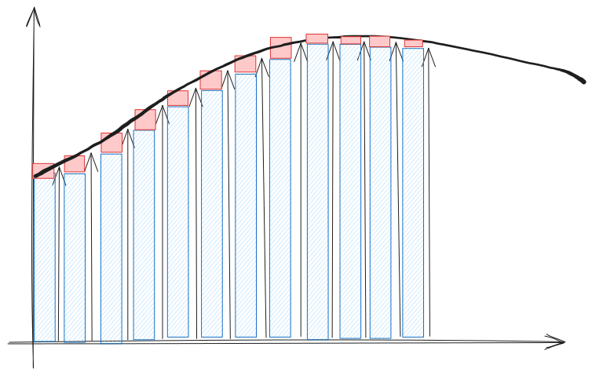
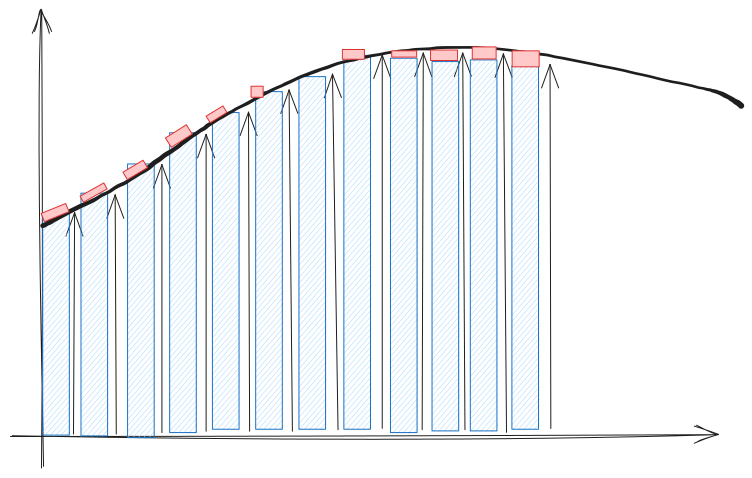
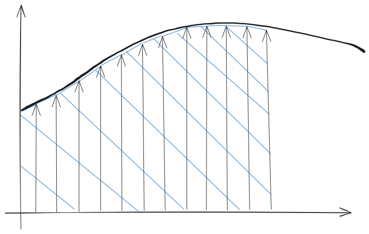

#Trasformazioni approssimate dal piano S al piano Z

### 1. Metodo delle Differenze all'Indietro (Backward Difference)

Questo metodo approssima l'integrale del segnale $u(t)$ in un intervallo di campionamento $\Delta t = T_c$ utilizzando il valore finale dell'intervallo $u((k+1)T_c)$ come altezza del rettangolo approssimante.

#### Approssimazione:
L'equazione che approssima la funzione continua $y(t) = \int u(t) dt$ nel dominio discreto è:
$$y((k + 1)T_c) = y(kT_c) + T_c u((k + 1)T_c)$$

#### Mappatura $S$ a $Z$:
Applicando la Trasformata $Z$ a questa equazione, si ottiene l'approssimazione dell'integrale $1/s$:

$$s = \frac{1 - z^{-1}}{T_c} = \frac{z - 1}{T_c z}$$

#### Conseguenze per la Stabilità:

*   **Regione di Stabilità:** Sostituendo $s$ con la sua espressione in termini di $z$, si ottiene che il semipiano stabile di $S$ ($\text{Re}[s] < 0$) viene mappato all'interno di una **circonferenza nel piano $Z$ centrata in $(1/2, 0)$ e con raggio $1/2$**.
*   **Vantaggio:** Una funzione di trasferimento stabile nel dominio di Laplace $G(s)$ risulterà **sempre stabile** nel dominio $Z$ $G(z)$ quando si utilizza questo metodo.
*   **Svantaggio:** Funzioni instabili in $S$ (con poli a $\text{Re}[s] > 0$) potrebbero eccezionalmente trasformarsi in funzioni stabili in $Z$ (con poli all'interno del cerchio unitario).

 

### 2. Metodo delle Differenze in Avanti (Forward Difference)

Questo metodo approssima l'area utilizzando il valore iniziale dell'intervallo $u(kT_c)$ come altezza del rettangolo.

#### Approssimazione:
L'equazione alle differenze che ne deriva è:
$$y((k + 1)T_c) = y(kT_c) + T_c u(kT_c)$$

#### Mappatura $S$ a $Z$:
Applicando la Trasformata $Z$, si ottiene l'approssimazione:

$$s = \frac{z - 1}{T_c}$$

#### Conseguenze per la Stabilità:

*   **Limitazione:** Questo metodo **non è generalmente utilizzato nella pratica**.
*   **Instabilità Potenziale:** La mappatura mostra che funzioni stabili in $S$ ($\text{Re}[s] < 0$) possono potenzialmente trasformarsi in funzioni instabili in $Z$ (con poli fuori dal cerchio unitario, sebbene con parte reale minore di 1).

### 3. Trasformazione Bilineare o di Tustin

Questo è un metodo comune basato sull'**integrazione trapezoidale**, che approssima l'area con un trapezio formato dai valori iniziale e finale dell'intervallo.

#### Approssimazione:
L'equazione alle differenze è:
$$y((k + 1)T_c) = y(kT_c) + \frac{T_c}{2} [u((k + 1)T_c) + u(kT_c)]$$

#### Mappatura $S$ a $Z$:
La trasformazione $s \to z$ risultante è:

$$s = \frac{2}{T_c} \frac{z - 1}{z + 1}$$

#### Conseguenze e Prewarping:

*   **Conservazione della Stabilità:** La trasformazione di Tustin è apprezzata perché **mappa il semipiano sinistro di $S$ (stabilità) all'interno del cerchio unitario di $Z$** (stabilità).
*   **Distorsione in Frequenza:** La trasformazione bilineare causa una **compressione alle alte frequenze**, introducendo delle distorsioni.
*   **Precompensazione (Prewarping):** Per limitare questa distorsione, si può usare la **precompensazione frequenziale (prewarping)**. Questa tecnica regola la pulsazione (omega) dei poli del controllore digitale prima della discretizzazione in modo che corrisponda alla frequenza analogica desiderata.

In generale, i metodi approssimati di discretizzazione possono talvolta fornire prestazioni migliori rispetto ai metodi esatti basati sulla Z-trasformata (come il metodo di conservazione della risposta impulsiva $G(z) = \mathcal{Z}\{g(kT_c)\}$).

